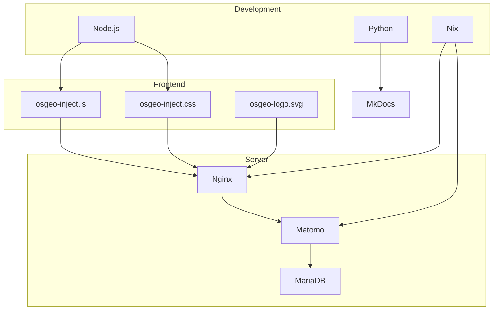

<!--
SPDX-FileCopyrightText: 2026 Tim Sketcher <tim@kartoza.com>
SPDX-License-Identifier: MIT
-->

# Package Architecture

This document provides an annotated list of all packages and dependencies in the OSGEO-Inject software architecture.

## Core Components

### Frontend Assets

| Package | Purpose | Size |
|---------|---------|------|
| `osgeo-inject.js` | Main JavaScript library | ~5KB |
| `osgeo-inject.css` | Badge styling | ~3KB |
| `osgeo-logo.svg` | OSGeo logo image | ~2KB |

### Content Files

| File | Purpose | Format |
|------|---------|--------|
| `announcement.json` | Current announcement | JSON |
| `history.json` | Announcement archive | JSON |
| `sites.json` | Onboarded sites list | JSON |

---

## Development Dependencies

### JavaScript Tooling

| Package | Version | Purpose |
|---------|---------|---------|
| `eslint` | ^8.56.0 | JavaScript linting |
| `prettier` | ^3.1.0 | Code formatting |
| `uglify-js` | ^3.17.0 | JavaScript minification |

### CSS Tooling

| Package | Version | Purpose |
|---------|---------|---------|
| `stylelint` | ^16.2.0 | CSS linting |
| `stylelint-config-standard` | ^36.0.0 | Standard CSS rules |
| `clean-css-cli` | ^5.6.0 | CSS minification |

### Testing

| Package | Version | Purpose |
|---------|---------|---------|
| (none) | - | No runtime dependencies |

---

## Nix Dependencies

### Development Shell

```nix
buildInputs = [
  # JavaScript
  nodejs_20              # JavaScript runtime
  nodePackages.npm       # Package manager
  nodePackages.eslint    # Linting
  nodePackages.prettier  # Formatting

  # Documentation
  python312Packages.mkdocs           # Documentation generator
  python312Packages.mkdocs-material  # Material theme
  python312Packages.mkdocs-mermaid2-plugin  # Mermaid diagrams

  # Shell scripting
  gum                    # Beautiful CLI components
  shellcheck             # Shell script linting
  shfmt                  # Shell formatting

  # Utilities
  jq                     # JSON processing
  curl                   # HTTP requests
  httpie                 # HTTP debugging

  # License compliance
  reuse                  # REUSE specification

  # Deployment
  nixos-anywhere         # Remote NixOS deployment

  # Database
  mariadb                # For Matomo backups
];
```

---

## Server Dependencies

### NixOS Services

| Service | Package | Purpose |
|---------|---------|---------|
| Nginx | `pkgs.nginx` | Web server with CORS |
| Matomo | `services.matomo` | Analytics platform |
| MariaDB | `pkgs.mariadb` | Matomo database |
| PHP-FPM | `services.phpfpm` | PHP runtime for Matomo |
| ACME | `security.acme` | Let's Encrypt certificates |

### System Packages

| Package | Purpose |
|---------|---------|
| `openssl` | Certificate generation |
| `rsync` | File synchronization |
| `gzip` | Compression |

---

## CI/CD Dependencies

### GitHub Actions

| Action | Version | Purpose |
|--------|---------|---------|
| `actions/checkout` | v4 | Repository checkout |
| `actions/setup-node` | v4 | Node.js setup |
| `actions/setup-python` | v5 | Python setup |
| `cachix/install-nix-action` | v25 | Nix installation |
| `fsfe/reuse-action` | v2 | License compliance |

---

## Dependency Graph



---

## Size Budget

| Category | Budget | Actual |
|----------|--------|--------|
| JavaScript (minified) | < 10KB | ~3KB |
| CSS (minified) | < 5KB | ~2KB |
| Images | < 50KB | ~2KB |
| **Total** | **< 15KB** | **~7KB** |

---

## Update Policy

- **Security Updates**: Immediate
- **Minor Updates**: Monthly review
- **Major Updates**: Quarterly evaluation

---

Made with 💗 by [Kartoza](https://kartoza.com) | [Donate!](https://github.com/sponsors/timlinux) | [GitHub](https://github.com/timlinux/osgeo-inject)
