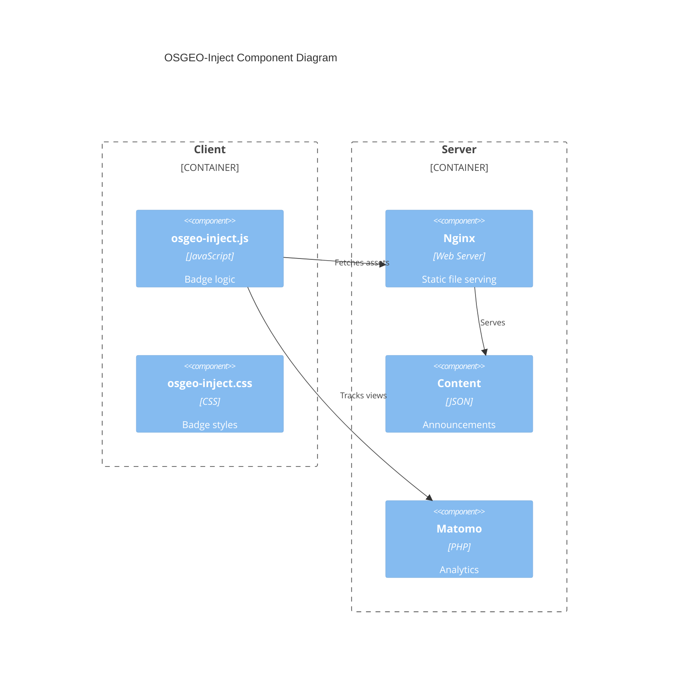
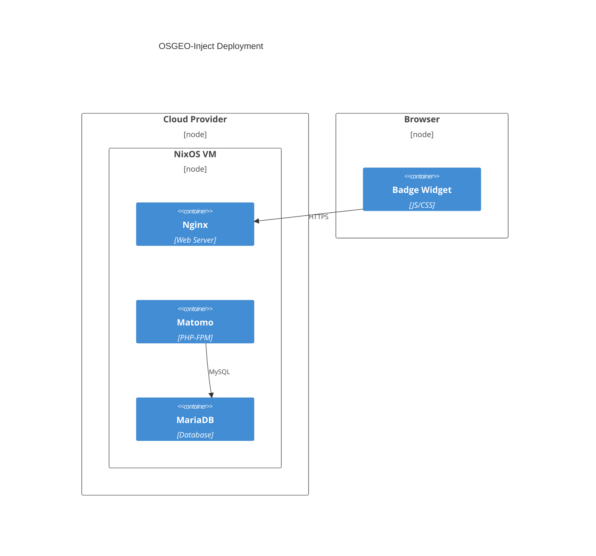
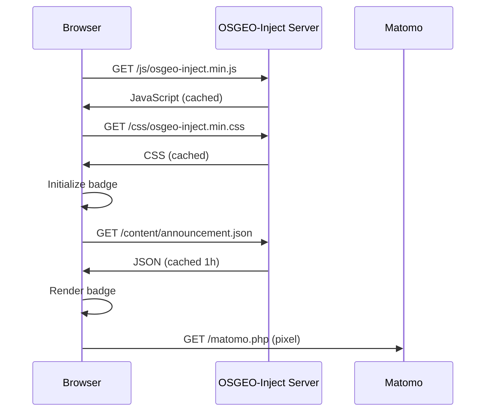

<!--
SPDX-FileCopyrightText: 2026 Tim Sketcher <tim@kartoza.com>
SPDX-License-Identifier: MIT
-->

# OSGEO-Inject Technical Specification

## Overview

OSGEO-Inject is a lightweight affiliate badge system for OSGeo community projects.
This document provides a complete technical specification for the system.

## Version

- **Current Version**: 0.1.0
- **Last Updated**: 2026-03-02

---

## 1. User Stories

### US-001: Website Integration
**As a** OSGeo project maintainer
**I want to** add a single script tag to my website
**So that** the OSGeo affiliate badge is displayed automatically

**Acceptance Criteria:**
- [ ] Badge displays without any additional configuration
- [ ] Badge loads asynchronously without blocking page render
- [ ] Badge works on all modern browsers

### US-002: Badge Position Configuration
**As a** website maintainer
**I want to** specify where the badge appears
**So that** it doesn't conflict with my site's design

**Acceptance Criteria:**
- [ ] Support for top-right, top-left, bottom-right, bottom-left positions
- [ ] Position specified via data attribute
- [ ] Default position is top-right

### US-003: Theme Support
**As a** website visitor
**I want** the badge to match my system theme preference
**So that** it doesn't appear jarring on dark mode sites

**Acceptance Criteria:**
- [ ] Auto-detect system theme preference
- [ ] Support manual light/dark override
- [ ] Smooth transition on theme change

### US-004: Announcement Display
**As an** OSGeo administrator
**I want to** display announcements to all project sites
**So that** community events are promoted effectively

**Acceptance Criteria:**
- [ ] Display current announcement with link
- [ ] Cache announcement to minimize requests
- [ ] Gracefully handle missing announcements

### US-005: Announcement Management
**As an** OSGeo administrator
**I want to** update announcements via CLI
**So that** I can quickly push news to all sites

**Acceptance Criteria:**
- [ ] Interactive TUI for announcement creation
- [ ] CLI mode for automation
- [ ] Announcement history tracking

### US-006: Site Onboarding
**As an** OSGeo administrator
**I want to** onboard new project sites
**So that** they can use the badge system

**Acceptance Criteria:**
- [ ] Add domain to CORS whitelist
- [ ] Deploy configuration changes
- [ ] Record onboarded sites

### US-007: Analytics Tracking
**As an** OSGeo administrator
**I want to** track badge impressions
**So that** I can measure community reach

**Acceptance Criteria:**
- [ ] Track page views via Matomo
- [ ] Capture hostname and path
- [ ] Privacy-respecting implementation

### US-008: Backup & Restore
**As an** system administrator
**I want to** backup and restore the system
**So that** I can recover from failures

**Acceptance Criteria:**
- [ ] Backup database, config, and content
- [ ] Verify backup integrity
- [ ] Restore to functional state

---

## 2. Functional Requirements

### FR-001: Badge Display
| ID | Requirement | Priority |
|----|-------------|----------|
| FR-001.1 | Badge SHALL display OSGeo logo | MUST |
| FR-001.2 | Badge SHALL display "An OSGeo Project" text | MUST |
| FR-001.3 | Badge SHALL display current announcement | SHOULD |
| FR-001.4 | Badge SHALL be collapsible | SHOULD |
| FR-001.5 | Badge SHALL support four corner positions | MUST |
| FR-001.6 | Badge SHALL be responsive on mobile | MUST |

### FR-002: Resource Loading
| ID | Requirement | Priority |
|----|-------------|----------|
| FR-002.1 | JavaScript SHALL load asynchronously | MUST |
| FR-002.2 | Total payload SHALL be under 15KB | MUST |
| FR-002.3 | Resources SHALL be served via HTTPS | MUST |
| FR-002.4 | Announcements SHALL be cached for 1 hour | SHOULD |

### FR-003: CORS Security
| ID | Requirement | Priority |
|----|-------------|----------|
| FR-003.1 | Server SHALL enforce CORS whitelist | MUST |
| FR-003.2 | Only approved domains SHALL load resources | MUST |
| FR-003.3 | Preflight requests SHALL be handled | MUST |

### FR-004: Analytics
| ID | Requirement | Priority |
|----|-------------|----------|
| FR-004.1 | System SHALL track page impressions | SHOULD |
| FR-004.2 | Tracking SHALL use pixel method | MUST |
| FR-004.3 | No PII SHALL be collected | MUST |

### FR-005: Administration
| ID | Requirement | Priority |
|----|-------------|----------|
| FR-005.1 | Announcements SHALL be manageable via CLI | MUST |
| FR-005.2 | Sites SHALL be onboardable via CLI | MUST |
| FR-005.3 | Scripts SHALL support interactive and automated modes | SHOULD |

### FR-006: Backup
| ID | Requirement | Priority |
|----|-------------|----------|
| FR-006.1 | System SHALL support full backups | MUST |
| FR-006.2 | Backups SHALL include checksums | SHOULD |
| FR-006.3 | Restoration SHALL be testable | SHOULD |

---

## 3. Non-Functional Requirements

### NFR-001: Performance
| ID | Requirement | Target |
|----|-------------|--------|
| NFR-001.1 | Time to first byte | < 50ms |
| NFR-001.2 | Total asset size | < 15KB |
| NFR-001.3 | Client-side initialization | < 100ms |
| NFR-001.4 | Cache hit rate | > 95% |

### NFR-002: Security
| ID | Requirement |
|----|-------------|
| NFR-002.1 | All traffic over HTTPS |
| NFR-002.2 | CSP headers on all responses |
| NFR-002.3 | XSS prevention via input sanitization |
| NFR-002.4 | Rate limiting on all endpoints |

### NFR-003: Availability
| ID | Requirement | Target |
|----|-------------|--------|
| NFR-003.1 | Uptime | 99.9% |
| NFR-003.2 | Graceful degradation | Required |

### NFR-004: Accessibility
| ID | Requirement |
|----|-------------|
| NFR-004.1 | WCAG 2.1 AA compliant |
| NFR-004.2 | Keyboard navigable |
| NFR-004.3 | Screen reader compatible |
| NFR-004.4 | Reduced motion support |

---

## 4. System Architecture

### 4.1 Component Diagram



### 4.2 Deployment Diagram



### 4.3 Data Flow



---

## 5. API Reference

### 5.1 Client API

```javascript
window.OSGeoInject = {
  init: Function,     // Manual initialization
  version: string,    // Library version
  config: Object      // Configuration object
};
```

### 5.2 Server Endpoints

| Endpoint | Method | Description |
|----------|--------|-------------|
| `/js/osgeo-inject.min.js` | GET | Minified JavaScript |
| `/css/osgeo-inject.min.css` | GET | Minified CSS |
| `/images/osgeo-logo.svg` | GET | OSGeo logo |
| `/content/announcement.json` | GET | Current announcement |
| `/content/history.json` | GET | Announcement history |
| `/health` | GET | Health check |

### 5.3 Announcement JSON Schema

```json
{
  "$schema": "http://json-schema.org/draft-07/schema#",
  "type": "object",
  "required": ["id", "message", "link", "published", "expires"],
  "properties": {
    "id": { "type": "string", "pattern": "^[0-9]{4}-[0-9]{3}$" },
    "message": { "type": "string", "maxLength": 100 },
    "link": { "type": "string", "format": "uri" },
    "published": { "type": "string", "format": "date-time" },
    "expires": { "type": "string", "format": "date-time" }
  }
}
```

---

## 6. Security Requirements

### 6.1 CORS Configuration

Only whitelisted origins may access resources:

- `*.osgeo.org`
- `*.qgis.org`
- `*.gdal.org`
- `*.geoserver.org`
- `*.postgis.net`
- `*.openlayers.org`
- `*.mapserver.org`
- `*.geonode.org`
- `*.pgrouting.org`
- `*.leafletjs.com`

### 6.2 Security Headers

| Header | Value |
|--------|-------|
| Strict-Transport-Security | max-age=31536000; includeSubDomains |
| X-Content-Type-Options | nosniff |
| X-Frame-Options | SAMEORIGIN |
| X-XSS-Protection | 1; mode=block |
| Referrer-Policy | strict-origin-when-cross-origin |

### 6.3 Rate Limiting

| Zone | Rate | Burst |
|------|------|-------|
| general | 10 req/s | 20 |
| api | 30 req/s | 50 |

---

## 7. Testing Requirements

### 7.1 Unit Tests

- JavaScript initialization
- Theme detection
- Announcement caching
- DOM manipulation

### 7.2 Integration Tests

- CORS validation
- Announcement fetching
- Analytics tracking

### 7.3 E2E Tests

- Badge display on sample page
- Position configurations
- Theme switching
- Mobile responsiveness

---

## 8. Glossary

| Term | Definition |
|------|------------|
| Badge | The visual OSGeo affiliate indicator |
| CORS | Cross-Origin Resource Sharing |
| Payload | Total size of JS + CSS + images |
| Pixel | 1x1 image used for analytics tracking |

---

Made with 💗 by [Kartoza](https://kartoza.com) | [Donate!](https://github.com/sponsors/timlinux) | [GitHub](https://github.com/timlinux/OSGEO-Inject)
