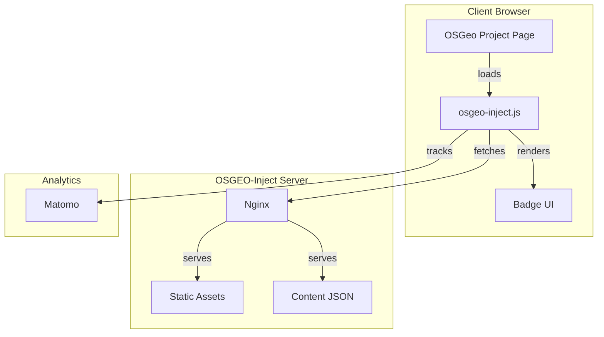
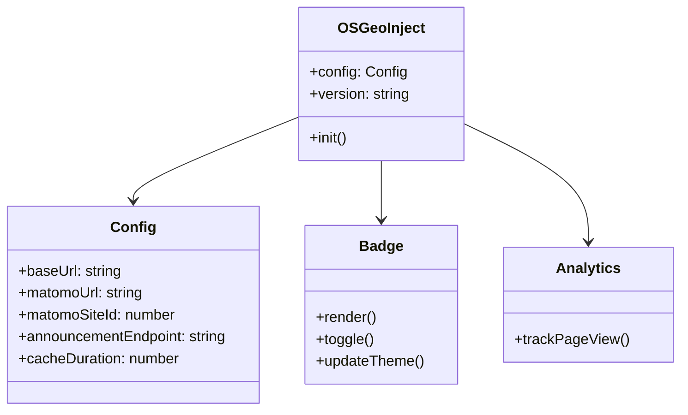
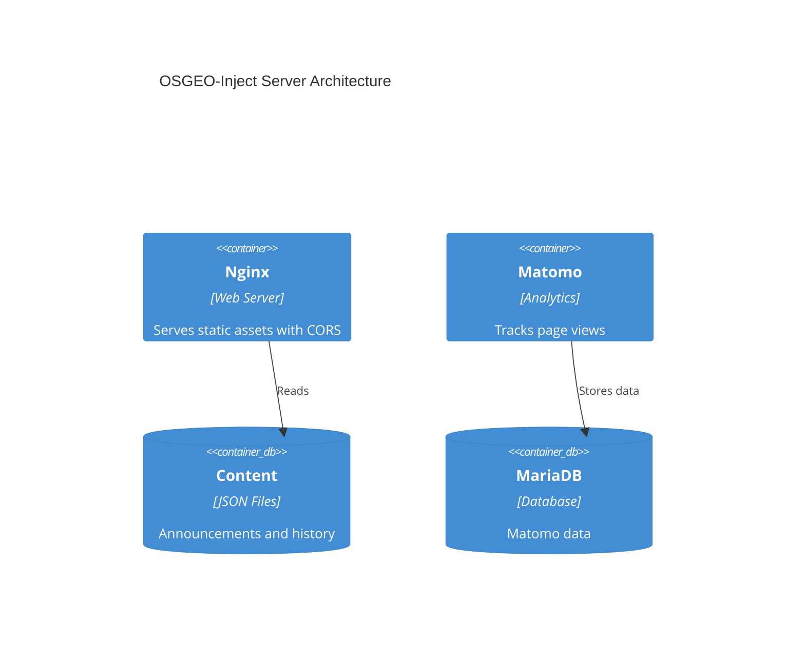
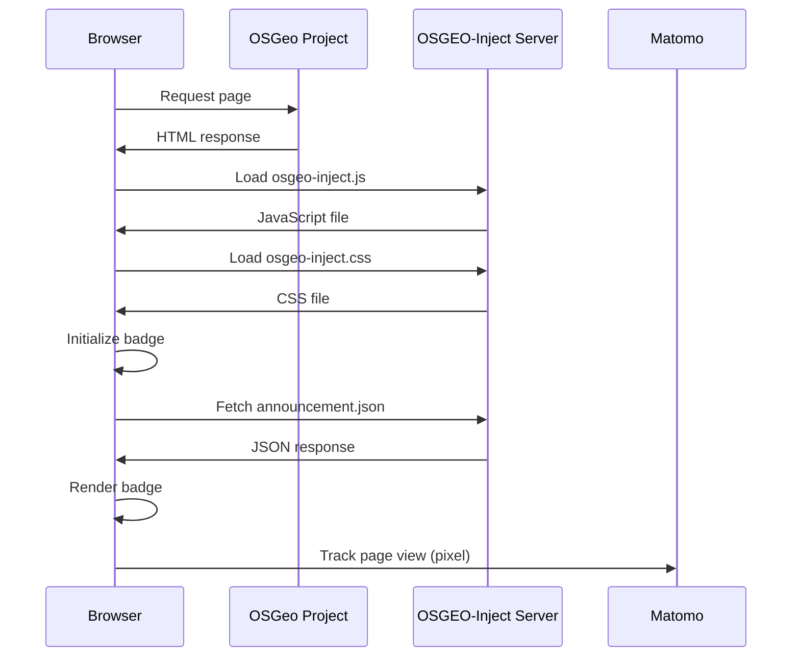
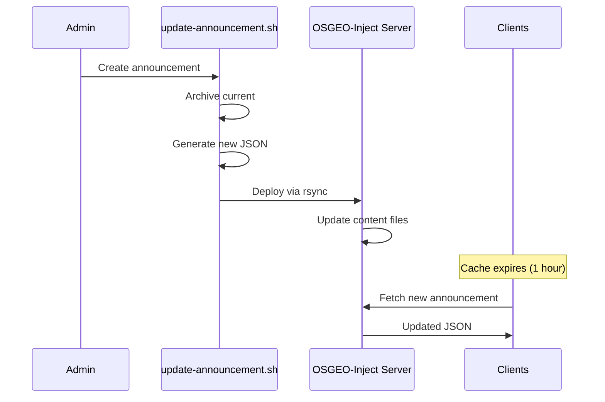
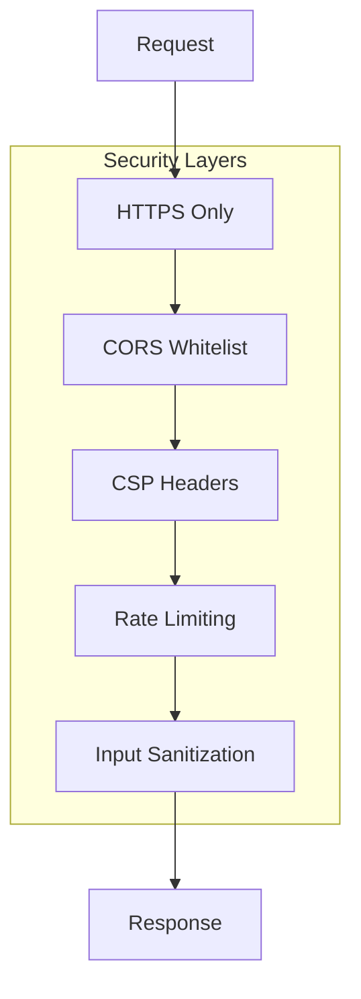
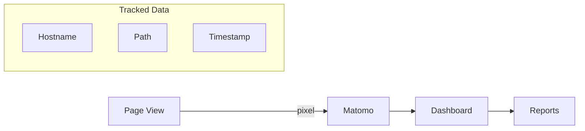
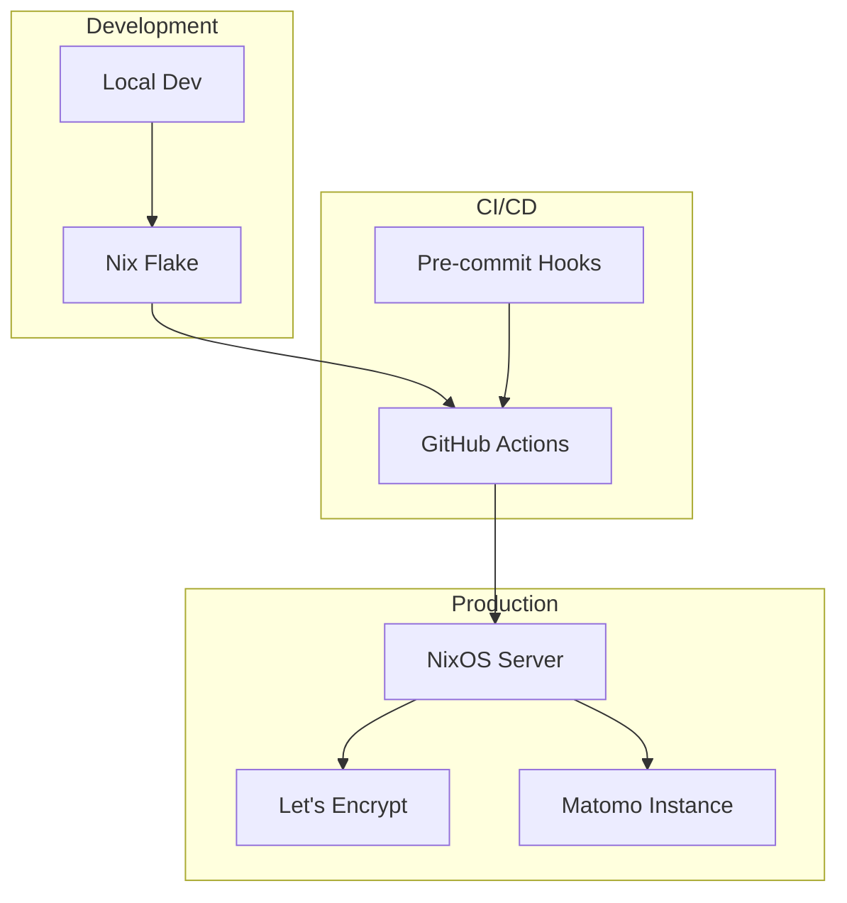

<!--
SPDX-FileCopyrightText: 2026 Tim Sketcher <tim@kartoza.com>
SPDX-License-Identifier: MIT
-->

# Architecture

This document describes the system architecture of OSGEO-Inject.

## System Overview



## Component Architecture

### Client Components



### Server Components



## Data Flow

### Page Load Sequence



### Announcement Update Flow



## File Structure

```
osgeo-inject/
├── src/
│   ├── js/
│   │   └── osgeo-inject.js      # Main JavaScript
│   ├── css/
│   │   └── osgeo-inject.css     # Styles
│   ├── content/
│   │   ├── announcement.json    # Current announcement
│   │   └── history.json         # Announcement history
│   └── images/
│       └── osgeo-logo.svg       # OSGeo logo
├── nginx/
│   └── nginx.conf               # Server configuration
├── nixos/
│   ├── module.nix               # NixOS module
│   └── vm-configuration.nix     # VM testbed
├── scripts/
│   ├── onboard-site.sh          # Site onboarding
│   ├── update-announcement.sh   # Announcement management
│   ├── backup.sh                # Backup workflow
│   └── restore.sh               # Restore workflow
├── docs/                        # MkDocs documentation
└── test/                        # Test files
```

## Security Model



### CORS Strategy

Only whitelisted OSGeo project domains can load the resources:

```nginx
map $http_origin $cors_origin {
    default "";
    "~^https?://.*\.osgeo\.org$" $http_origin;
    "~^https?://.*\.qgis\.org$" $http_origin;
    # ... other OSGeo projects
}
```

### Content Security Policy

```
Content-Security-Policy: default-src 'self';
                         script-src 'self';
                         style-src 'self' 'unsafe-inline';
                         img-src 'self' data:;
                         connect-src 'self'
```

## Performance Optimizations

### Caching Strategy

| Resource | Cache Duration | Strategy |
|----------|----------------|----------|
| JavaScript | 1 hour | `must-revalidate` |
| CSS | 1 hour | `must-revalidate` |
| Images | 7 days | `immutable` |
| Announcements | 15 minutes | `must-revalidate` |

### Asset Size Budget

| Asset | Budget | Minified |
|-------|--------|----------|
| JavaScript | < 10KB | ✓ |
| CSS | < 5KB | ✓ |
| Images | < 50KB each | Optimized |
| **Total** | **< 15KB** | |

### Client-Side Caching

```javascript
// localStorage caching
const cacheKey = "osgeo-inject-announcement";
const cacheTimeKey = "osgeo-inject-announcement-time";
const cacheDuration = 3600000; // 1 hour
```

## Monitoring & Analytics



## Deployment Architecture


