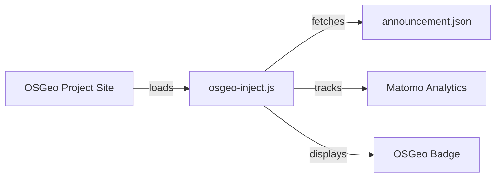
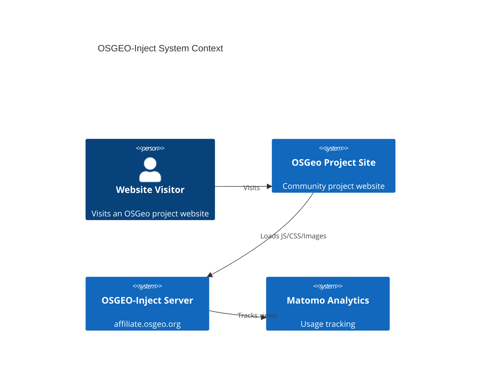

<!--
SPDX-FileCopyrightText: 2026 Tim Sketcher <tim@kartoza.com>
SPDX-License-Identifier: MIT
-->

# OSGEO-Inject

**Lightweight affiliate badge system for OSGeo community projects**

[](https://github.com/timlinux/OSGEO-Inject/actions/workflows/ci.yml)
[](https://opensource.org/licenses/MIT)

## Overview

OSGEO-Inject is a minimal, high-performance JavaScript widget that displays OSGeo affiliation badges and announcements on participating project websites. Designed with security and performance as the highest priorities, the entire payload is under 15KB and loads asynchronously to never impact host page performance.



## Key Features

- **Tiny Footprint**: Under 15KB total (JS + CSS + images)
- **Zero Dependencies**: Pure JavaScript and CSS, no external libraries
- **Security First**: Strict CORS policies, CSP compliant
- **Performance Optimized**: Async loading, aggressive caching
- **Accessible**: WCAG 2.1 AA compliant
- **Themeable**: Light/dark mode support with auto-detection
- **Analytics**: Matomo integration for usage tracking

## Quick Start

Add these two lines to your HTML:

```html
<script
  src="https://affiliate.osgeo.org/js/osgeo-inject.min.js"
  defer
  data-position="top-right"
></script>
<link
  rel="stylesheet"
  href="https://affiliate.osgeo.org/css/osgeo-inject.min.css"
/>
```

That's it! The OSGeo badge will appear in the specified position on your page.

## Architecture



## How It Works

1. **Loading**: The script loads asynchronously, never blocking page render
2. **Configuration**: Reads options from `data-*` attributes
3. **Fetching**: Retrieves current announcement from the server (cached for 1 hour)
4. **Rendering**: Creates a minimal DOM structure for the badge
5. **Tracking**: Sends a single pixel request to Matomo for analytics

## Support This Project

This project is maintained by volunteers in the OSGeo community. If you find it useful, please consider supporting its development:

- [GitHub Sponsors](https://github.com/sponsors/timlinux)
- [Ko-fi](https://ko-fi.com/kartoza)

---

Made with 💗 by [Kartoza](https://kartoza.com) | [Donate!](https://github.com/sponsors/timlinux) | [GitHub](https://github.com/timlinux/OSGEO-Inject)
